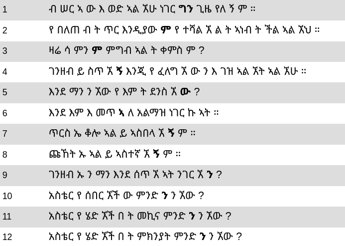

# Notes on trankit

## Setup on MLTGPU

### GitHub
1. ssh into MLTGPU: `ssh -p 62266 YOUR-GU-USERNAME@mltgpu.flov.gu.se`
2. authenticate into GitHub:
   1. generate an ssh key: `ssh-keygen`
   2. copy the output of `cat THE-NAME-OF-YOUR-SSH-KEY.pub` to GitHub user settings > SSH and GPG keys > New SSH key
   3. start the ssh agent: `eval "$(ssh-agent -s)"`
   4. add the key: `ssh-add THE-NAME-OF-YOUR-SSH-KEY`
3. clone the repo: `git clone git@github.com:Jembda/MLT-Thesis.git`

### Python
1. create a __Python 3.10__ environment with conda: `conda create -n THE-NAME-OF-YOUR-ENVIRONMENT python=3.10`
2. activate it: `conda activate THE-NAME-OF-YOUR-ENVIRONMENT`
3. install trankit: `pip install trankit`
4. install numpy separately: `pip install "numpy<2"`

Now you should be able to run the training script.

## Stuff nobody tells you

### You have to train the full pipeline 
It seems not to be possible to use an "incomplete" pipeline (e.g. a parser that does not lemmatize, or a tagger for pre-tokenized text), even if its stages are trained independently from each other. In our case, this means that we have to train all necessary components. For high-resource languages, it may be possible to download pretrained modules, but there seem to be issues with that too (cf. [#80](https://github.com/nlp-uoregon/trankit/issues/80))

### The lemmatizer is picky
The lemmatizer is not capable of dealing with the `_`s in the `LEMMA` columns (see [#48](https://github.com/nlp-uoregon/trankit/issues/48) for more information). To solve this problem:

1. remove MWTs with either:
   - `cleanconl.py` from [MaChAmp](https://github.com/machamp-nlp/machamp) (`machamp/scripts/misc/cleanconl.py`; requires the entire `machamp/scripts` folder) (__note:__ this merges back all MWTs), or
   - by removing range lines and adding `SpaceAfter=No` where necessary (cf. third block in [`formats.conllu`](formats.conllu)). This would be a workaround for keeping the expanded multitokens without trankit (or MaChAmp) complaining about the official, not fully supported UDv2 MWT notation
2. autofill the remaining empty lemmas, e.g. using the function `fill_empty_lemmas` from [`remove_MWTs_from_conllu.py`](../Scripts/remove_MWTs_from_conllu.py) (__question for Dawit:__ linguistically, does it make sense to put the `FORM` there or should we replace that with some placeholder? For context, in the official UD treebank, the lemma-less forms are the ones highlighted in bold:
   
   all of them are UPOS-tagged `X` and have `goewith` in the `DEPREL` field)

### The MWT expander is mysterious
It seems that the MWT expander requires training data in yet another format, but we still haven't figured out whether that's actually the case and, if so, which format (cf. [#91](https://github.com/nlp-uoregon/trankit/issues/91))